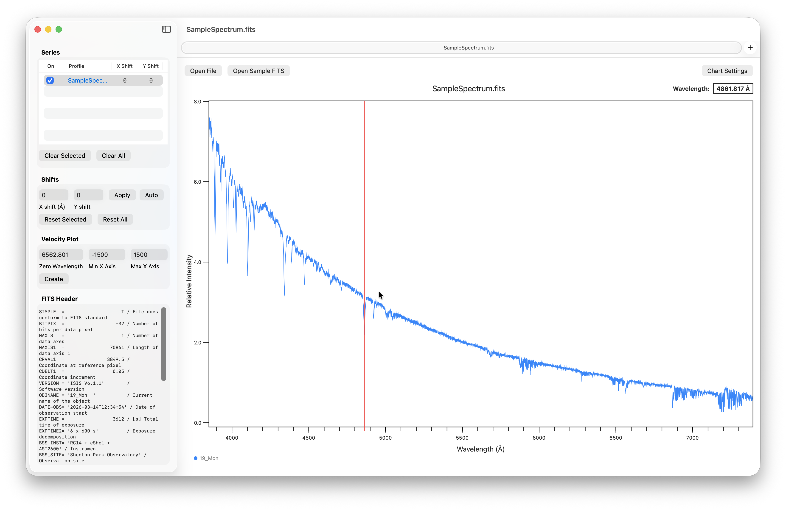
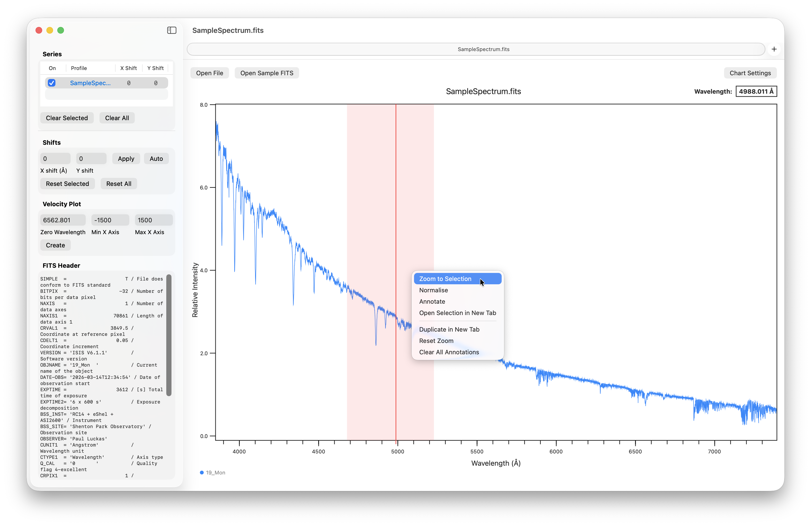
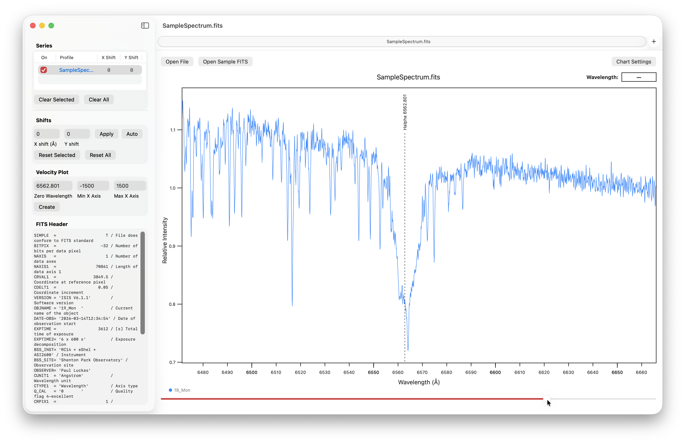
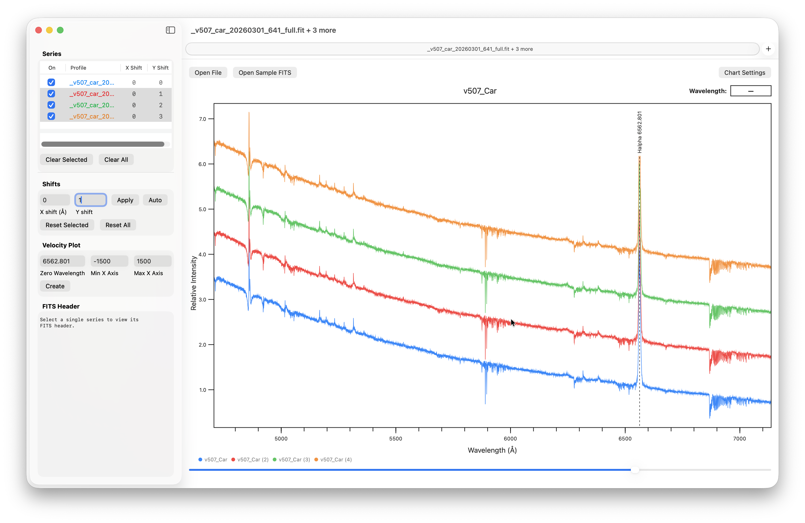
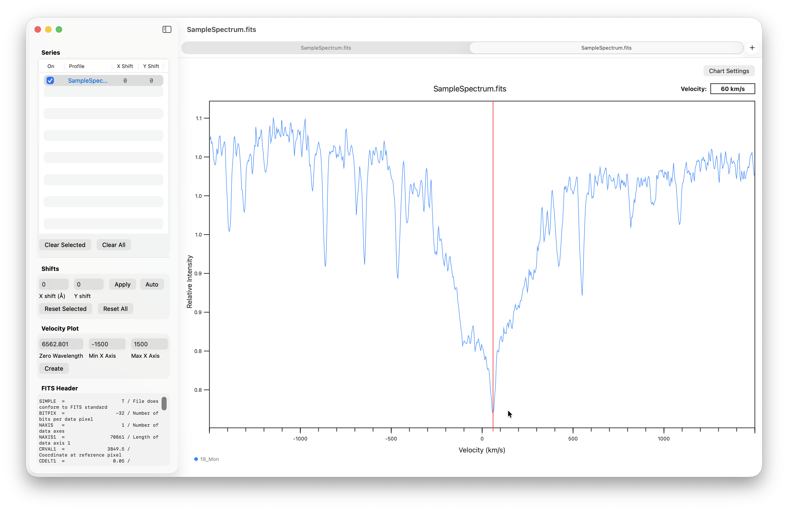
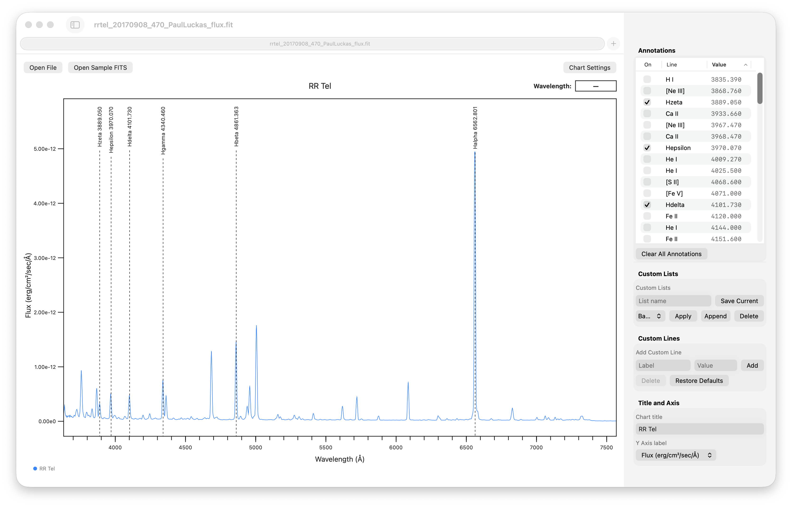
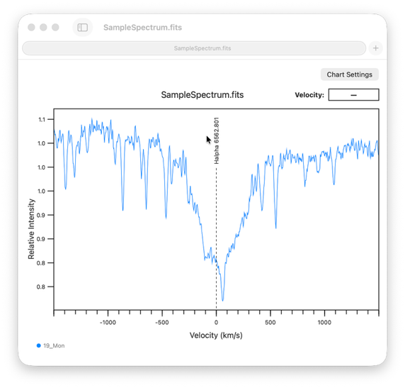

# Spectro Plot User Guide

Spectro Plot is a macOS application designed for inspecting astronomical spectral profiles, such as those produced by ISIS, Demetra, BASS and similar software.

It mirrors many of the basic features of Tim Lester's excellent Windows application, PlotSpectra.

Spectro Plot supports simple calibrated 1D FITS spectral profiles and text files with two columns: wavelength and intensity. More complex FITS data products, including 2D and 3D datasets, are not supported.

## Contents

- [Requirements](#requirements)
- [Basic operation](#basic-operation)
- [Sidebar](#sidebar)
- [Velocity plot](#velocity-plot)
- [Chart settings](#chart-settings)
- [Custom spectral line lists](#custom-spectral-line-lists)
- [Tab views](#tab-views)
- [Saving plots](#saving-plots)

## Requirements

Spectro Plot has been tested on macOS 26 Tahoe and macOS 15 Sequoia.

## Basic operation

Open a profile using the **Open File** button, or choose **Open Sample FITS** to open the included sample file.

Move your mouse cursor across the plot to view the wavelength display updated continuously.



Left-click and highlight a region of interest. Right-click, or Control-click, to open the context menu. From there, you can zoom in on the selected region or add line annotations from the built-in spectral line list.



## Sidebar

The left-hand sidebar displays a list of open spectral profiles and details of the currently selected target in the list.

- The series checkboxes control the visibility of files in the chart view.
- Colours can be modified by right-clicking on targets in the series table.
- The FITS header for the currently selected file is also displayed.

The sidebar can be resized and hidden. A separator below the series table can be dragged to adjust panel sizing.



Profiles can be individually shifted in both X, wavelength, and Y, intensity.

The **Auto** shift feature automates shifting a series of spectra by the same amount. Start with a Y increment of less than 1, select the targets you wish to shift, and then select **Auto**.



## Velocity plot

The sidebar includes a basic velocity plot feature that provides a means to quickly investigate the approximate radial velocity of single or multiple selected profiles.

Enter a desired zero wavelength and X-axis limits, and then select **Create**.

The velocity plot will open in a new tab, with the cursor now displaying a live velocity value in km/s.

> [!NOTE]
> Velocity values in Spectro Plot are approximate, single-feature estimates. They are intended for quick visual reference only and are not system-wide radial velocity measurements derived from full-spectrum methods such as cross-correlation.



## Chart settings

Additional chart settings are available by opening the **Chart Settings** inspector.

A sortable annotation list is displayed where individual lines can be manually selected for display.



## Custom spectral line lists

Custom lists can also be created and then applied or appended to an existing chart view.

Custom lists can also be imported using **File > Import Custom List CSV**.

The CSV format is:

```csv
label,wavelength
```

Custom spectral lines can be added to the database, and the entire database can also be restored to default.

## Tab views

Spectro Plot uses standard macOS tabs that allow individual views to be detached and reattached for easy display.



## Saving plots

Use the toolbar Export PNG button, or choose File > Export Plot as PNG, to save the current chart view directly as an image file for observing notes, reports, presentations, or sharing. The exported image reflects the currently displayed plot, including visible profiles, annotations, zoom state, and other chart settings.

### Tips for best results

- Resize the Spectro Plot window before capturing to control resolution.
- Use the area selection tool for precise cropping.
- Ensure the plot is fully visible and not obscured.
